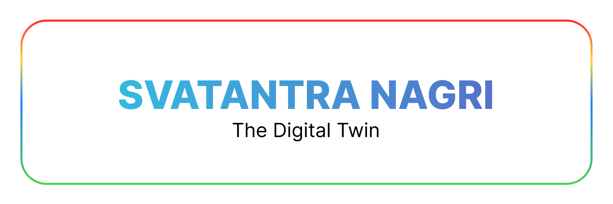
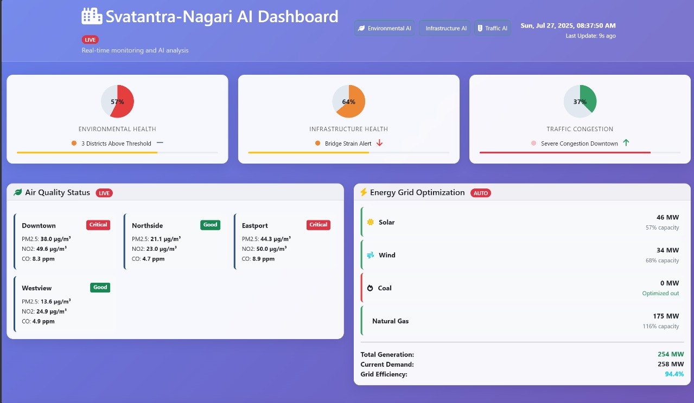
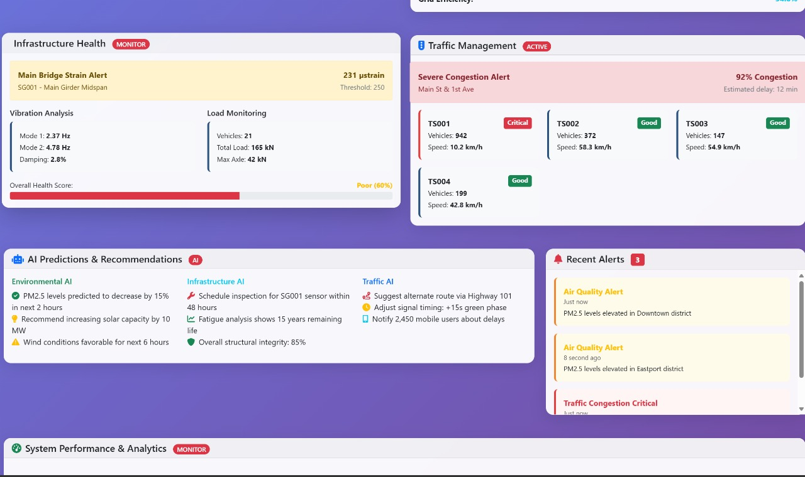
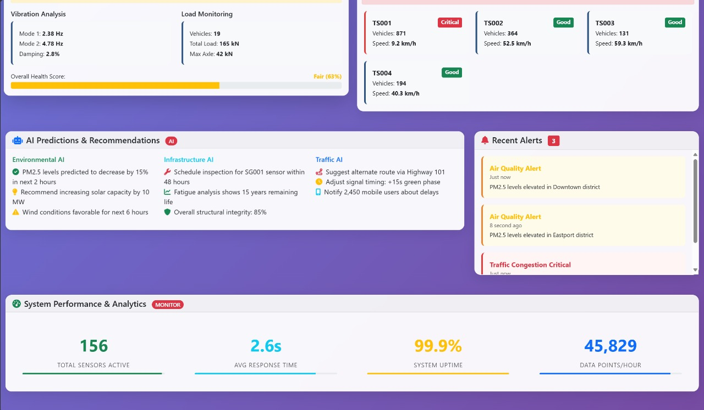
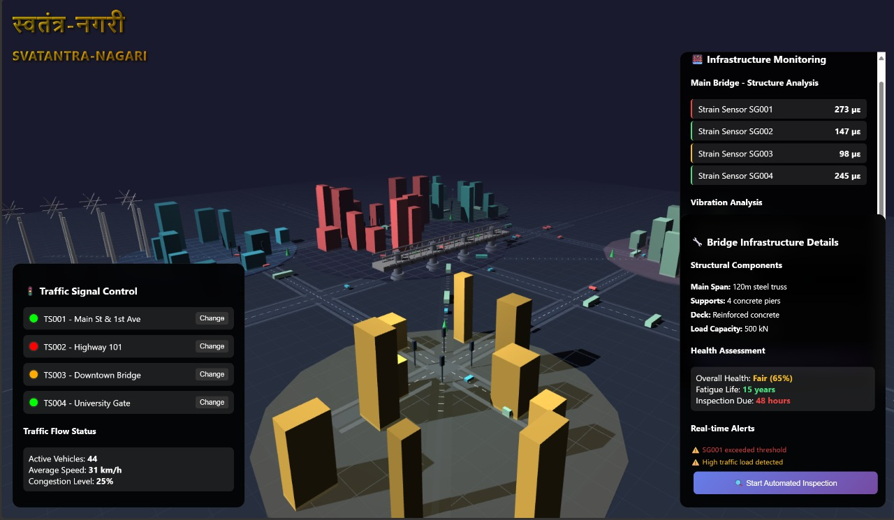

# Svatantra-Nagari: Autonomous City Management with Agentic AI

  
*Powered by Google Cloud and Agentic AI*

## Overview
**Svatantra-Nagari** (Autonomous City) is an AI-driven urban management system that leverages a **Digital Twin** and **multi-agent AI** to proactively optimize city operations—from traffic flow to infrastructure health—using real-time data. Built on **Google Cloud Platform (GCP)**, this solution transforms reactive city management into a predictive, autonomous framework.

---

## Key Features
- **Proactive & Predictive Management**: Anticipate traffic jams, infrastructure failures, and pollution hotspots.
- **Real-time Digital Twin**: A dynamic virtual replica of the city for risk-free simulations.
- **Multi-Agent Orchestration**: Specialized AI agents (traffic, infrastructure, environment) collaborate across domains.
- **Scalable Analytics**: Petabyte-scale data processing with **BigQuery ML** and **Vertex AI**.

---

## Architecture
  
*Data flows from IoT sensors → GCP processing → Digital Twin → Agentic AI actions.*

### Core Components:
1. **Data Ingestion**: IoT sensors, cameras, and public data streams via **Cloud Pub/Sub**.
2. **Digital Twin Layer**: Virtual city replica integrating real-time data.
3. **Agentic AI Layer**: Autonomous agents (traffic, infrastructure, environment) powered by **Vertex AI** and **Agentspace**.
4. **Actions & Services**: Direct control of traffic signals, maintenance scheduling, and citizen alerts.

---

## Agent System
| Agent | Role | Example Action |
|--------|------|----------------|
| `traffic_agent.py` | Optimizes traffic flow | Adjusts signal timings to prevent congestion |
| `infra_agent.py` | Monitors bridges/roads | Schedules repairs for strain anomalies |
| `env_agent.py` | Tracks pollution/energy | Recommends solar capacity adjustments |
| `traffic_agent_using_adk/agent.py` | Sends citizen alerts | Notifies 2,450 users about delays |

---

## Demo Screenshots
### 1. Digital Twin Dashboard
  
*Live metrics: Traffic congestion (37%), bridge health (65%), and active vehicles (44).*

### 2. Infrastructure Health Alert
  
*Real-time strain analysis and vibration monitoring for bridges.*

### 3. Traffic Management
  
*AI recommendations: Alternate routes, signal adjustments, and mobile alerts.*

### 4. The Digital Twin
  
---

## Technologies Used
- **Google Cloud**: Vertex AI, BigQuery, Dataflow, Cloud Run, Agentspace.
- **Agent Development Kit (ADK)**: For rapid agent prototyping.
- **3D Visualization**: Digital twin demo (Unity/Unreal Engine).
- **Frontend**: Firebase Studio, Cloud Endpoints.

---

## Made with ❤️ by Team Thunder
  **Krish Panchani** (Team Lead) | **Yash Oza** (Team Member)  | **Google Cloud Agentic AI Day**  
*"From data overload to autonomous resilience."*
